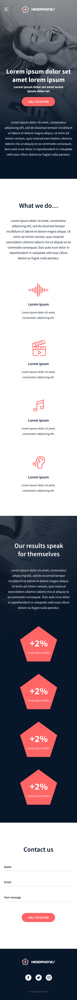
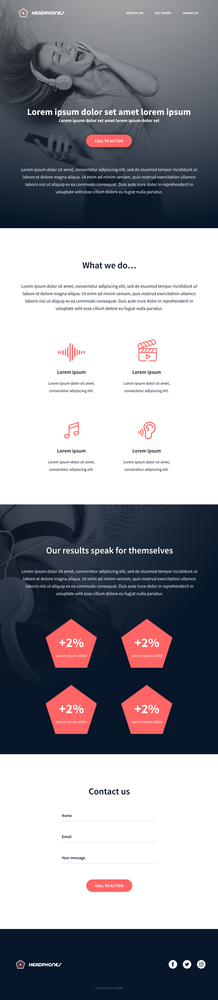

# ALX_HTML_CSS
+ These repository is created to help us practice advanced HTML and CSS.

+ We will buid and stylish a website with HTML and CSS.

+ I'm very excited to present the result!

## CSS_ADVANCED : Apply your CSS Knowledge
We will apply and use advanced CSS concepts.

To get this result:

## HEADPHONES : Apply both your HTML and CSS knowledge

In this project, we will implement from scratch, without any library, a web page. We will use all HTML/CSS/Accessibility/Responsive design knowledges that you learned previously.

We won’t have a lot of instruction, We are free to implement it the way that We want - the objective is simple: Have a fully functional web page that looks the same as the designer file.

Here the final result:
+ Desktop view

+ Mobile view

+ Tablet view
